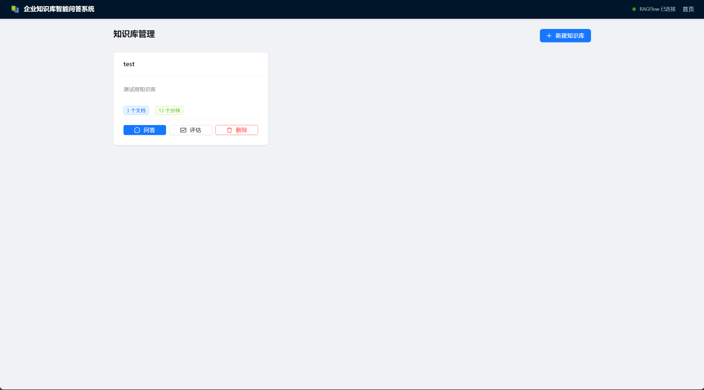
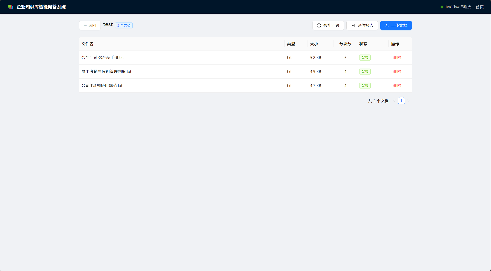
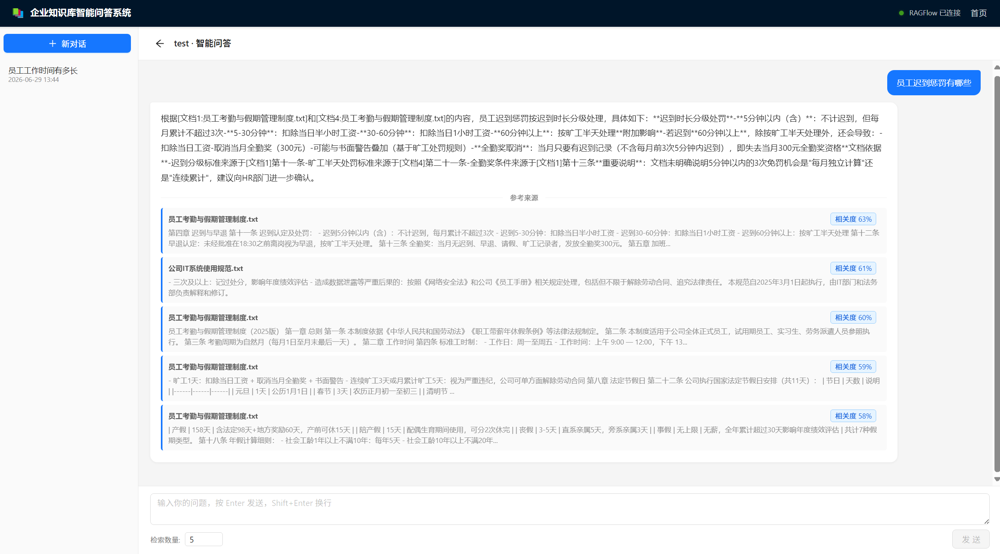
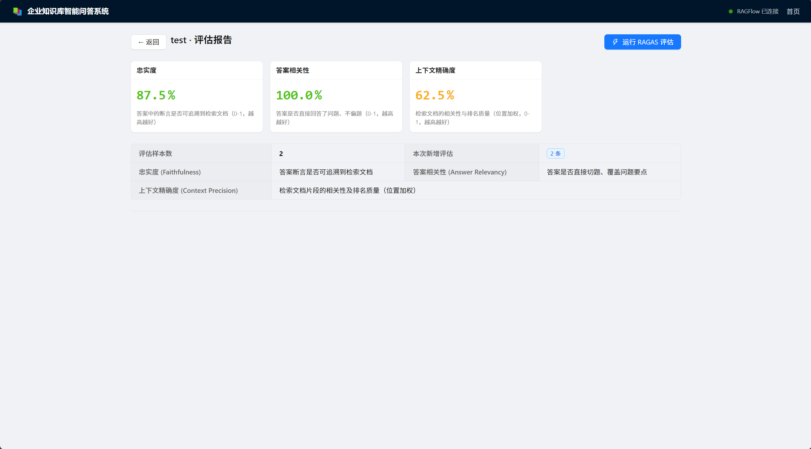
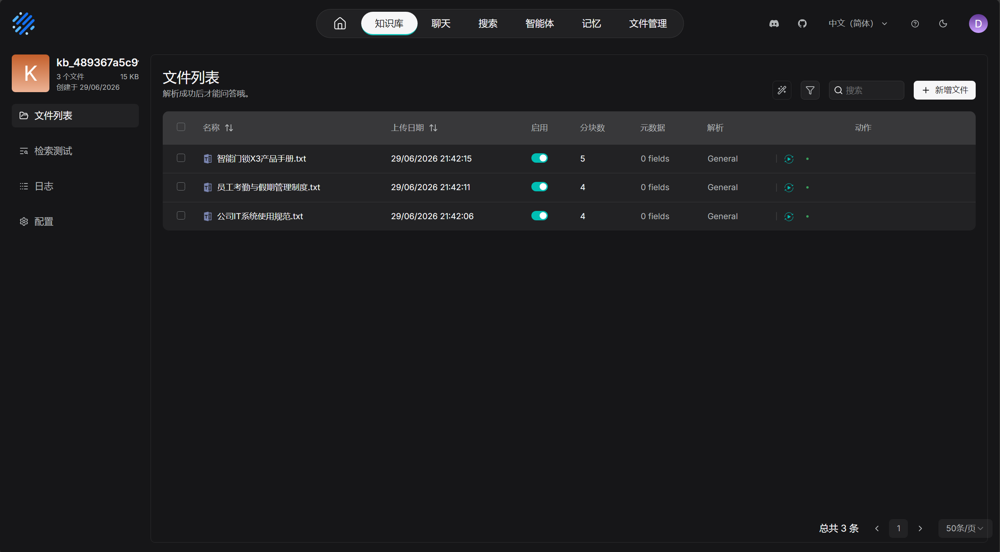

# MP-RAG — 企业知识库智能问答系统

基于 RAG（检索增强生成）架构从头构建的企业级知识库问答平台，涵盖文档解析、混合检索、流式生成、质量评估的完整闭环。

---

## 目录

- [项目简介](#项目简介)
- [系统架构](#系统架构)
- [环境要求](#环境要求)
- [第一步：获取 API Key](#第一步获取-api-key)
- [第二步：克隆项目并配置环境](#第二步克隆项目并配置环境)
- [第三步：安装依赖](#第三步安装依赖)
- [第四步：初始化数据库](#第四步初始化数据库)
- [第五步：启动 RAGFlow 文档引擎](#第五步启动-ragflow-文档引擎)
- [第六步：构建前端](#第六步构建前端)
- [第七步：启动后端](#第七步启动后端)
- [第八步：使用系统](#第八步使用系统)
- [RAGAS 评估详解](#ragas-评估详解)
- [API 参考](#api-参考)
- [项目结构](#项目结构)
- [设计决策](#设计决策)
---

## 项目简介

这是一个帮你把**私有文档变成可提问的知识库**的全栈项目。核心流程只有两步：

1. **上传文档** → 系统自动解析、分块、向量化
2. **提出问题** → 系统检索相关片段，交给 LLM 生成带来源引用的回答

除此之外，还内置了一套**自动化评估系统**，用另一个 LLM 给回答质量打分，帮你持续监控 RAG 管道的好坏。

### 界面预览

| 知识库管理 | 文档管理 |
|------------|----------|
|  |  |

| 智能问答 | RAGAS 评估报告 |
|---------|---------------|
|  |  |

| RAGFlow 文档引擎 |
|-----------------|
|  |

### 核心技术组件

| 组件 | 作用 | 官方地址 |
|------|------|---------|
| [RAGFlow](https://github.com/infiniflow/ragflow) | 文档解析、分块、向量化、混合检索 | https://ragflow.io/ |
| [DeepSeek](https://platform.deepseek.com/) | LLM 生成与评估 | https://api.deepseek.com |
| [RAGAS](https://github.com/vibrantlabsai/ragas) | RAG 质量评估框架 | https://docs.ragas.io/ |
| [FastAPI](https://fastapi.tiangolo.com/) | 后端 API 框架 | https://github.com/fastapi/fastapi |
| [Ant Design Vue](https://antdv.com/) | 前端 UI 组件库 | https://github.com/vueComponent/ant-design-vue |

---

## 系统架构

```
浏览器 (Vue 3 + Ant Design Vue 4)
  │  HTTP / SSE
  ▼
FastAPI 后端 (Python 3.11)
  ├─ api/kb.py         知识库 CRUD
  ├─ api/document.py   文档上传/列表/删除
  ├─ api/qa.py         问答接口（SSE 流式）
  └─ api/eval.py       RAGAS 评估
  │
  ├─ services/qa_service.py
  │   ├─ 关键词提取（LLM）
  │   ├─ RAGFlow 混合检索（向量 + BM25 + Reranker）
  │   └─ DeepSeek 流式生成
  │
  ├─ evaluation/runner.py
  │   ├─ Faithfulness 评估（陈述拆解 → 逐条验证）
  │   ├─ Answer Relevancy 评估（问题要点覆盖检查）
  │   └─ Context Precision 评估（位置加权 Precision@k）
  │
  ▼
┌──────────┬──────────────────┬─────────────────┐
│  MySQL   │     RAGFlow      │   DeepSeek API  │
│  元数据   │  文档解析/分块    │  deepseek-v4-pro│
│  聊天记录 │  向量化/混合检索   │  deepseek-v4-flash│
│  评估数据 │  (Docker 部署)    │  (评估)          │
└──────────┴──────────────────┴─────────────────┘
```

**文档入库流水线：** 上传 → RAGFlow 解析 + 分块 + Embedding → MySQL 记录状态

**智能问答流水线：** 用户问题 → LLM 提取关键词 → RAGFlow 混合检索 → 构建 Prompt → DeepSeek SSE 流式输出

---

## 环境要求

### 你的电脑需要安装

| 软件 | 最低版本 | 如何检查 | 下载地址 |
|------|---------|---------|---------|
| **Python** | 3.11+ | `python --version` | https://www.python.org/downloads/ |
| **Node.js** | 18+ | `node --version` | https://nodejs.org/ |
| **MySQL** | 8.0+ | `mysql --version` | https://dev.mysql.com/downloads/ |
| **Docker** | 24+ | `docker --version` | https://www.docker.com/products/docker-desktop/ |
| **Git** | 2.30+ | `git --version` | https://git-scm.com/downloads |

### Python 依赖（`requirements.txt`）

```
fastapi>=0.119.0            # Web 框架
uvicorn[standard]>=0.34.0   # ASGI 服务器
python-multipart>=0.0.20    # 文件上传支持
python-dotenv>=1.2.2        # 环境变量加载
httpx>=0.28.0               # HTTP 客户端（调用外部 API）
openai>=2.37.0              # DeepSeek SDK（兼容 OpenAI 接口）
sqlalchemy>=2.0.0           # ORM 数据库操作
pymysql>=1.1.0              # MySQL 驱动
qdrant-client>=1.10.0       # Qdrant 向量数据库客户端
PyMuPDF>=1.24.0             # PDF 解析（降级路径）
python-docx>=1.0.0          # Word 解析（降级路径）
Pillow>=10.0.0              # 图片处理
ragas>=0.2.0                # RAG 评估框架
datasets>=3.0.0             # Ragas 依赖
```

---

## 第一步：获取 API Key

项目依赖以下外部服务，需要提前注册并获取 API Key：

### 必填

| 服务 | 用途 | 注册/获取地址 |
|------|------|-------------|
| **DeepSeek** | LLM 生成 + 评估 | https://platform.deepseek.com/api_keys |
| **MySQL** | 数据持久化 | 本地安装，用自己设的密码 |

### 推荐（启用 RAGFlow）

| 服务 | 用途 | 注册/获取地址 |
|------|------|-------------|
| **RAGFlow** | 文档解析 + 混合检索 | 本地 Docker 部署，API Key 在 RAGFlow 管理后台生成 |
| **DashScope（阿里云）** | Embedding 向量化 | https://dashscope.aliyun.com/ → API-KEY 管理 |

### 可选（降级路径）

| 服务 | 用途 | 注册/获取地址 |
|------|------|-------------|
| **Qdrant Cloud** | 向量存储（RAGFlow 离线时使用） | https://cloud.qdrant.io/ → API Keys |
| **Neo4j Aura** | 知识图谱（可选） | https://console.neo4j.io/ |

> 💡 **最小可运行配置**：只需要 DeepSeek API Key + 本地 MySQL。不启动 RAGFlow 时系统会自动降级到本地解析器。

---

## 第二步：克隆项目并配置环境

```bash
# 克隆
git clone https://github.com/qsh3/MP-rag.git
cd MP-rag

# 创建虚拟环境
python -m venv .venv

# 激活虚拟环境
# Windows:
.venv\Scripts\activate
# macOS / Linux:
source .venv/bin/activate

# 复制环境变量模板
cp .env.example .env
```

### 编辑 `.env` 文件

用任意文本编辑器打开 `.env`，填入你在第一步获取的 Key：

```ini
# ========== 必填 ==========
DEEPSEEK_API_KEY=sk-你的DeepSeek密钥
DEEPSEEK_BASE_URL=https://api.deepseek.com

# MySQL
MYSQL_HOST=localhost
MYSQL_PORT=3306
MYSQL_USER=root
MYSQL_PASSWORD=你的MySQL密码
MYSQL_DATABASE=kb_qa_system

# ========== 推荐 ==========
# RAGFlow（启动 Docker 后在 RAGFlow 管理后台生成）
RAGFLOW_BASE_URL=http://localhost
RAGFLOW_API_KEY=ragflow-你的Key
USE_RAGFLOW=true

# DashScope Embedding
DASHSCOPE_API_KEY=sk-你的阿里云Key
```

---

## 第三步：安装依赖

```bash
# 确保虚拟环境已激活（终端前面应该有 (.venv) 字样）
pip install -r requirements.txt
```

---

## 第四步：初始化数据库

确保 MySQL 服务正在运行，然后执行：

```bash
python init_db.py
```

这条命令会自动创建所需的数据库和表（`knowledge_bases`、`documents`、`chat_history`、`evaluation_records`）。

---

## 第五步：启动 RAGFlow 文档引擎

> 如果暂时不想配置 RAGFlow，可以跳过此步。系统会自动降级到本地解析器 + Qdrant 向量存储。

### 5.1 启动 RAGFlow Docker

参考 [RAGFlow 官方文档](https://ragflow.io/docs/dev/)：

```bash
# 克隆 RAGFlow
git clone https://github.com/infiniflow/ragflow.git
cd ragflow/docker

# 启动服务（首次启动需要拉取镜像，约 5-10 分钟）
docker compose up -d
```

### 5.2 获取 RAGFlow API Key

1. 浏览器打开 http://localhost（RAGFlow 管理界面）
2. 注册/登录账号
3. 点击右上角头像 → **API** → 生成新 API Key
4. 将生成的 Key 填入 `.env` 的 `RAGFLOW_API_KEY`

### 5.3 验证 RAGFlow 连接

```bash
# 启动后端后，访问健康检查接口
curl http://localhost:8000/api/v1/health

# 返回示例：
# {"status": "healthy", "ragflow": "connected", "deepseek": "ok", "mysql": "ok"}
```

---

## 第六步：构建前端

```bash
cd frontend

# 安装前端依赖
npm install

# 构建生产版本
npm run build

cd ..
```

构建产物在 `frontend/dist/`，后端会自动托管静态文件。

---

## 第七步：启动后端

```bash
# 确保在项目根目录，虚拟环境已激活
python main.py
```

启动成功后会看到：

```
INFO:     Started server process [xxxxx]
INFO:     Uvicorn running on http://0.0.0.0:8000
==================================================
  企业知识库智能问答系统
  http://0.0.0.0:8000
  API 文档: http://0.0.0.0:8000/docs
==================================================
```

### 前端开发模式（可选）

如果想修改前端代码并热重载：

```bash
cd frontend
npm run dev        # 启动 Vite 开发服务器，默认 http://localhost:5173
```

开发模式下前端请求会自动代理到后端 8000 端口（配置在 `frontend/vite.config.ts` 中）。

---

## 第八步：使用系统

浏览器打开 **http://localhost:8000**，你会看到：

### 操作流程

1. **创建知识库** — 点击「新建知识库」，输入名称和描述
2. **上传文档** — 点击知识库卡片 → 上传 PDF/Word/Excel 等文档，等待解析完成（状态变为"就绪"）
3. **开始提问** — 点击知识库卡片上的「问答」按钮，输入问题
4. **查看评估** — 点击知识库卡片上的「评估」按钮，运行 RAGAS 自动评估

### 命令行测试

```bash
# 创建知识库
curl -X POST http://localhost:8000/api/v1/kb \
  -H "Content-Type: application/json" \
  -d '{"name": "技术文档库", "description": "公司技术文档"}'

# 上传文档（将 kb_id 替换为上一步返回的 id）
curl -X POST http://localhost:8000/api/v1/kb/{kb_id}/docs \
  -F "files=@/path/to/your/document.pdf"

# 提问
curl -X POST http://localhost:8000/api/v1/qa/ask \
  -H "Content-Type: application/json" \
  -d '{"kb_id": "{kb_id}", "question": "这份文档的主要内容是什么？"}'

# 运行评估
curl -X POST http://localhost:8000/api/v1/eval/run \
  -H "Content-Type: application/json" \
  -d '{"kb_id": "{kb_id}"}'
```

---

## RAGAS 评估详解

项目集成了 [RAGAS](https://github.com/vibrantlabsai/ragas) 评估框架，但用自己实现的版本替换了官方库调用（以便精细控制 Prompt 和模型选择）。

### 三项评估指标

#### 1. Faithfulness（忠实度）— 答案能不能从文档中找到依据

```
计算步骤:
  ┌─────────────┐     ┌──────────────────┐     ┌──────────────┐
  │ 拆解答案     │ ──▶ │ 逐条判断是否能在  │ ──▶ │ 有依据数/总数 │
  │ 为独立陈述   │     │ 文档中找到依据    │     │ = 0.0 ~ 1.0  │
  └─────────────┘     └──────────────────┘     └──────────────┘

示例:
  答案: "公司有20天年假，可通过HR系统申请"
  拆解: ① 公司有20天年假  ② 年假通过HR系统申请
  验证: ① true（文档第3页明确写了）  ② true（文档第5页有说明）
  分数: 2/2 = 1.0
```

#### 2. Answer Relevancy（答案相关性）— 答案有没有跑题

```
计算步骤:
  ┌─────────────┐     ┌──────────────────┐     ┌──────────────┐
  │ 分析问题包含  │ ──▶ │ 逐条检查答案是否  │ ──▶ │ 已覆盖数/总数 │
  │ 几个关键要点  │     │ 覆盖了每个要点    │     │ = 0.0 ~ 1.0  │
  └─────────────┘     └──────────────────┘     └──────────────┘
```

#### 3. Context Precision（上下文精确度）— 检索排名好不好

```
使用 Ragas 官方的位置加权公式:

  对每个位置 k（从1开始）:
    如果第k个片段相关 → 累计 Precision@k = 前k个中相关数 / k
    如果第k个片段无关 → 不累计

  最终分数 = 所有累计的 Precision@k 之和 / 总相关片段数

为什么位置加权？
  排在第1位相关的片段价值 > 排在第5位相关的片段
  好的检索系统应该把最相关的片段排在前面
```

### 设计要点

- **评估模型**：使用 `deepseek-v4-flash`（成本远低于 v4-pro，评估场景只需简单判断）
- **确定性输出**：`temperature=0` + `seed=42`，同一输入始终得到相同分数
- **增量评估**：已评分的条目自动跳过，避免重复消耗 token
- **并发执行**：3 个样本 + 3 个指标并发调用，评估速度提升约 3 倍

---

## API 参考

启动后端后，访问 **http://localhost:8000/docs** 可查看完整的 Swagger 交互式文档。

| 方法 | 端点 | 说明 |
|------|------|------|
| `POST` | `/api/v1/kb` | 创建知识库 |
| `GET` | `/api/v1/kb` | 获取知识库列表 |
| `GET` | `/api/v1/kb/{id}` | 获取知识库详情（含文档数/分块数） |
| `DELETE` | `/api/v1/kb/{id}` | 删除知识库及其关联数据 |
| `POST` | `/api/v1/kb/{id}/docs` | 上传文档（multipart/form-data） |
| `GET` | `/api/v1/kb/{id}/docs` | 获取文档列表 |
| `DELETE` | `/api/v1/kb/{id}/docs/{did}` | 删除文档 |
| `POST` | `/api/v1/qa/ask` | 提问（SSE 流式返回，含来源引用） |
| `GET` | `/api/v1/qa/history/{kb_id}` | 获取历史问答记录 |
| `DELETE` | `/api/v1/qa/session/{kb_id}/{sid}` | 删除对话会话 |
| `POST` | `/api/v1/eval/run` | 运行 RAGAS 评估 |
| `GET` | `/api/v1/eval/report/{kb_id}` | 获取评估报告 |
| `GET` | `/api/v1/eval/data/{kb_id}` | 获取评估原始数据 |
| `GET` | `/api/v1/health` | 健康检查（含 RAGFlow 连通性） |

---

## 项目结构

```
MP/
├── main.py                    # 应用入口（启动时自动清缓存）
├── app.py                     # FastAPI 实例定义
├── config.py                  # 统一从 .env 加载配置
├── rag_client.py              # RAGFlow REST API 封装
│
├── api/                       # 路由层（薄层，只做参数校验和响应格式化）
│   ├── kb.py                  #   知识库 CRUD
│   ├── document.py            #   文档上传/列表/删除
│   ├── qa.py                  #   问答 SSE 端点
│   └── eval.py                #   评估触发/报告
│
├── services/                  # 业务逻辑层
│   ├── kb_service.py          #   知识库业务 + RAGFlow dataset 管理
│   ├── qa_service.py          #   RAG 管道：关键词提取 → 检索 → 生成
│   └── llm_service.py         #   DeepSeek 调用（流式 + JSON 模式 + seed 固定）
│
├── models/                    # 数据层
│   ├── schemas.py             #   Pydantic 请求/响应校验
│   └── db_models.py           #   SQLAlchemy ORM（4 张表）
│
├── evaluation/                # RAGAS 评估子系统
│   ├── collector.py           #   从 ChatHistory + EvaluationRecord 采集数据
│   └── runner.py              #   LLM-as-Judge：3 指标 × 3 并发 × 增量跳过
│
├── core/                      # 本地降级模块（RAGFlow 离线时启用）
│   ├── parser.py              #   PyMuPDF + python-docx 文档解析
│   └── chunker.py             #   滑动窗口分块
│
└── frontend/                  # Vue 3 前端项目
    └── src/
        ├── pages/
        │   ├── DashboardPage.vue      # 知识库卡片列表
        │   ├── KnowledgeBasePage.vue  # 文档管理
        │   ├── QAPage.vue            # 流式对话
        │   └── EvalPage.vue          # 评估报告
        ├── api/                # axios + SSE 客户端
        ├── stores/             # Pinia 状态
        ├── types/              # TS 类型定义
        └── styles/             # 全局样式
```

---

## 设计决策

| 决策 | 选择 | 理由 |
|------|------|------|
| 文档引擎 | RAGFlow | 开箱即用的解析/分块/向量化/混合检索/Reranker，避免手写整套 RAG 管道 |
| LLM 模型 | DeepSeek | 中文能力强、成本为 OpenAI 的 1/10、API 完全兼容 OpenAI SDK |
| 评估模型 | deepseek-v4-flash | 评估场景只需 yes/no 判断，flash 比 pro 快 3 倍且便宜 |
| 流式传输 | SSE | 单向流式场景 SSE 比 WebSocket 更简单，CDN/代理兼容性好 |
| 评估一致性 | temperature=0 + seed=42 | 结构化评估 Prompt + 确定性参数，确保每次评估结果一致 |
| 检索优化 | LLM 关键词提取 | 短查询（如"有多少表"）直接搜索命中率低，先拆成关键词再检索 |
| 并发策略 | ThreadPoolExecutor(3) | I/O 密集型 LLM 调用，3 并发在速度和 API 限流之间取平衡 |
| 降级设计 | 本地解析 + Qdrant | RAGFlow 离线时自动切换，系统仍可用 |

---

## 许可证

MIT License

---

## 参考链接

- [RAGFlow 官方文档](https://ragflow.io/docs/dev/) — 文档引擎部署与配置
- [RAGFlow GitHub](https://github.com/infiniflow/ragflow) — 开源 RAG 引擎
- [RAGAS 官方文档](https://docs.ragas.io/) — 评估框架使用指南
- [RAGAS GitHub](https://github.com/vibrantlabsai/ragas) — 评估指标实现参考
- [DeepSeek 开发者平台](https://platform.deepseek.com/) — API Key 获取
- [DashScope 阿里云](https://dashscope.aliyun.com/) — Embedding 服务
- [FastAPI 文档](https://fastapi.tiangolo.com/) — 后端框架
- [Ant Design Vue](https://antdv.com/) — 前端组件库
